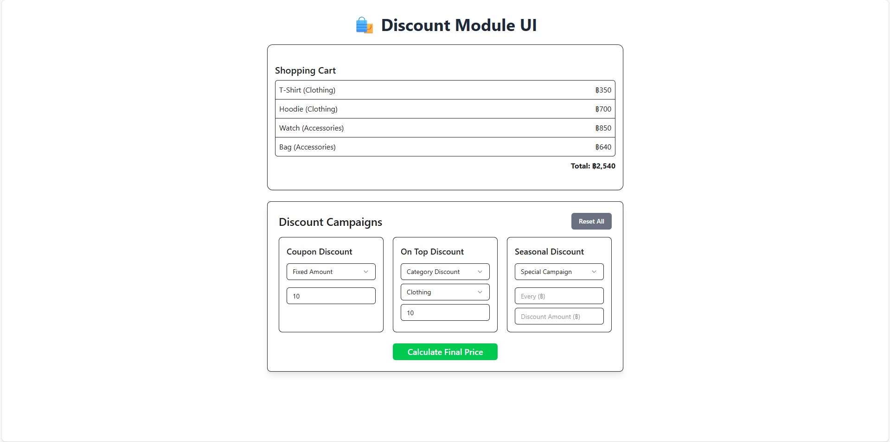

# 🛍️ Discount Module

A web-based **Discount Calculator** that allows users to apply and combine multiple discount campaigns (Fixed, Percentage, Category, and more) to a shopping cart — built with **React**, **Vite**, **TailwindCSS**, and **Shadcn UI**.

---

## 📸 Screenshot



---

## 🎯 Project Objective

This project is a **shopping cart discount calculator** that supports multiple discount types applied simultaneously, including:

- 💵 Fixed Amount  
- 📉 Percentage Discount  
- 🏷️ Category Discount  
- 🎊 Special / Seasonal Campaign  

The system displays the total price, eligible discounts, and the final price after calculation with a clear and user-friendly breakdown.

---

## 🧠 Tech Stack

- ⚛️ **React** — Frontend framework  
- ⚡ **Vite** — Fast build tool for modern development  
- 🎨 **Tailwind CSS** — Utility-first CSS framework  
- 🧩 **Shadcn UI** — Accessible UI component library  
- 🪝 **Custom Hooks** — For discount logic and reusable state  
- 🧾 **JavaScript (ES6)** — Main programming language  

---

## ⚙️ Installation & Setup

Clone this repository and install dependencies:

```bash
npm install
